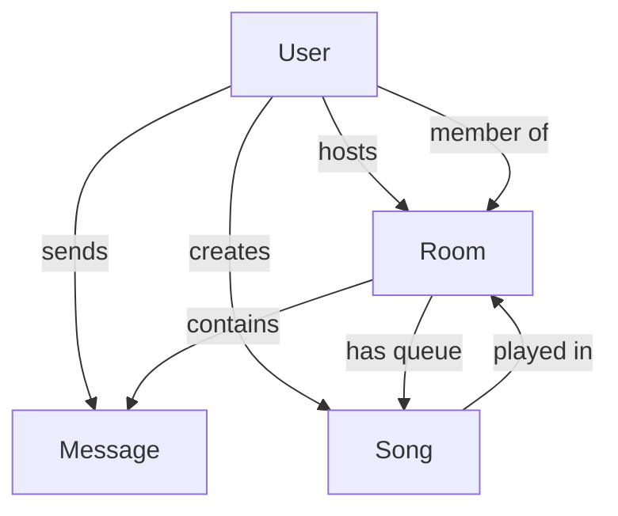

# 🏗️ MusicApp Architecture Guide

## 📋 System Overview

MusicApp is a full-stack MERN application with real-time features and AI integration, designed for synchronized music listening and social interaction.

### 🎯 Core Technologies
- **Frontend**: React 18, Tailwind CSS, Socket.io Client
- **Backend**: Node.js, Express.js, Socket.io Server
- **Database**: MongoDB with Mongoose ODM
- **Authentication**: JWT + Google OAuth (Passport.js)
- **AI Integration**: Google Gemini API
- **Real-time**: Socket.io for WebSocket communication
- **Deployment**: Docker, Vercel, Railway/Render

## 🏛️ Architecture Patterns

### 1. **Frontend Architecture (React)**
```
src/
├── contexts/          # React Context for state management
│   ├── AuthContext    # User authentication state
│   ├── ThemeContext   # Dark/light theme
│   ├── SocketContext  # Real-time communication
│   └── RoomContext    # Room and music state
├── components/        # Reusable UI components
│   ├── ui/           # Generic UI elements
│   └── auth/         # Authentication components
├── pages/            # Route-based page components
└── App.js            # Main application component
```

**Pattern**: Context + Hooks pattern for state management
**Benefits**: Centralized state, real-time updates, type-safe contexts

### 2. **Backend Architecture (Express)**
```
backend/
├── models/           # MongoDB schemas (Mongoose)
├── routes/           # API route handlers
├── middleware/       # Custom middleware (auth, validation)
├── socket/           # Socket.io event handlers
├── config/           # Configuration files
└── server.js         # Application entry point
```

**Pattern**: MVC-like separation with middleware layers
**Benefits**: Modular design, clear separation of concerns, scalable

### 3. **Database Schema Design**
```
Users ──┐
        ├── Rooms ──┐
        │           ├── Messages
        │           └── Songs (Queue)
        └── Songs (Created)
```

**Pattern**: Document-based design with references
**Benefits**: Flexible schema, optimized queries, efficient relationships

## 🔄 Data Flow

### 1. **Authentication Flow**
```
Client ──► Login Request ──► JWT Generation ──► Cookie Storage
   ↑                                              ↓
   └────── Protected Resources ←────── Token Validation
```

### 2. **Real-time Communication Flow**
```
User Action ──► Socket Event ──► Server Processing ──► Broadcast
     ↑                                                    ↓
     └────────── UI Update ←────── Socket Event ←─────────┘
```

### 3. **Music Synchronization Flow**
```
Host Control ──► Socket Event ──► Update DB ──► Broadcast State
     ↑                                              ↓
     └── All Clients ←── UI Sync ←── Receive Event ←┘
```

## 🧩 Component Hierarchy

### Frontend Component Tree
```
App
├── AuthProvider
│   ├── SocketProvider
│   │   ├── RoomProvider
│   │   │   ├── Home
│   │   │   ├── Dashboard
│   │   │   └── Room
│   │   │       ├── MusicPlayer
│   │   │       ├── Queue
│   │   │       └── Chat
│   │   └── Profile
│   └── Login/Signup
└── ThemeProvider
```

### Context Dependencies
```
AuthContext ──► SocketContext ──► RoomContext
     ↑               ↑                ↑
     └── User State  └── Connection   └── Room State
```

## 🔐 Security Architecture

### 1. **Authentication Layers**
```
Request ──► Rate Limit ──► CORS ──► JWT Validation ──► Route Handler
```

### 2. **Authorization Matrix**
| Role | Create Room | Control Music | Moderate Chat | Manage Users |
|------|-------------|---------------|---------------|--------------|
| Guest | ❌ | ❌ | ❌ | ❌ |
| Member | ✅ | ❌ | ❌ | ❌ |
| Moderator | ✅ | ⚠️ | ✅ | ⚠️ |
| Host | ✅ | ✅ | ✅ | ✅ |

### 3. **Security Measures**
- **Input Validation**: express-validator + Joi schemas
- **SQL Injection**: Mongoose ODM protection
- **XSS Protection**: React built-in escaping + CSP headers
- **CSRF Protection**: SameSite cookies + CORS configuration
- **Rate Limiting**: Per-IP and per-user limits
- **File Upload Security**: Type/size validation + sandboxing

## 🌐 API Design

### RESTful Endpoints Structure
```
/api/
├── auth/              # Authentication endpoints
├── rooms/             # Room management
├── music/             # Music and queue management
├── chat/              # Chat and messaging
└── ai/                # AI-powered features
```

### Socket.io Events Structure
```
Client Events          Server Events
├── join-room         ├── room-joined
├── leave-room        ├── user-joined/left
├── send-message      ├── new-message
├── music-play        ├── music-update
└── typing-start      └── user-typing
```

## 📊 Database Design

### 1. **Schema Relationships**


### 2. **Indexing Strategy**
- **Users**: email (unique), googleId (sparse), currentRoom
- **Rooms**: hostId, members.userId, isActive, lastActivity
- **Songs**: text search (title, artist), genre, addedBy
- **Messages**: roomId + createdAt (compound), senderId

### 3. **Data Consistency**
- **Atomic Operations**: MongoDB transactions for critical updates
- **Real-time Sync**: Socket.io events + database updates
- **Conflict Resolution**: Last-write-wins for music controls

## 🤖 AI Integration Architecture

### 1. **Gemini API Integration**
```
User Input ──► Context Builder ──► Gemini API ──► Response Parser ──► UI Update
```

### 2. **AI Feature Types**
- **Chat Suggestions**: Context-aware reply generation
- **Music Recommendations**: Mood/genre-based suggestions
- **Content Moderation**: Inappropriate content detection
- **Room Descriptions**: Auto-generated room descriptions

### 3. **Rate Limiting & Caching**
- Per-user rate limits (20 requests/15 minutes)
- Response caching for similar requests
- Graceful fallbacks when AI unavailable

## 🚀 Deployment Architecture

### 1. **Development Environment**
```
Local Machine
├── MongoDB (Docker/Local)
├── Backend (Node.js)
├── Frontend (React Dev Server)
└── Redis (Optional)
```

### 2. **Production Environment**
```
Frontend (Vercel) ──► Backend (Railway/Render) ──► MongoDB Atlas
                            ├── Socket.io
                            └── File Storage
```

### 3. **Container Architecture**
```
Docker Network
├── Frontend Container (Nginx)
├── Backend Container (Node.js)
├── MongoDB Container
└── Redis Container (Optional)
```

## 📈 Performance Considerations

### 1. **Frontend Optimizations**
- **Code Splitting**: Route-based lazy loading
- **Memoization**: React.memo and useMemo for expensive operations
- **Virtual Scrolling**: For large chat histories and song lists
- **Image Optimization**: Lazy loading and responsive images

### 2. **Backend Optimizations**
- **Database Indexing**: Strategic indexes for common queries
- **Connection Pooling**: MongoDB connection optimization
- **Compression**: Gzip compression for API responses
- **Caching**: Redis for session storage and frequently accessed data

### 3. **Real-time Optimizations**
- **Socket.io Rooms**: Efficient event broadcasting
- **Event Debouncing**: Typing indicators and music controls
- **Connection Management**: Automatic reconnection and cleanup

## 🔍 Monitoring & Observability

### 1. **Logging Strategy**
```
Application Logs ──► Winston ──► Log Files
Error Logs ──► Sentry ──► Alert System
Performance Metrics ──► Custom Middleware ──► Analytics
```

### 2. **Health Checks**
- **API Health**: `/api/health` endpoint
- **Database Health**: MongoDB connection status
- **Socket Health**: Connection count monitoring
- **AI Service Health**: Gemini API status checks

### 3. **Error Handling**
- **Global Error Handler**: Express error middleware
- **Socket Error Handling**: Graceful disconnection handling
- **Frontend Error Boundaries**: React error boundaries
- **Retry Logic**: Automatic retries for transient failures

## 🧪 Testing Strategy

### 1. **Test Pyramid**
```
E2E Tests (Cypress)
    ↑
Integration Tests (Jest + Supertest)
    ↑
Unit Tests (Jest + React Testing Library)
```

### 2. **Testing Coverage**
- **Backend**: API endpoints, socket events, database operations
- **Frontend**: Component rendering, user interactions, context logic
- **Integration**: Full user flows, real-time features
- **E2E**: Critical user journeys, cross-browser compatibility

## 🔄 Development Workflow

### 1. **Git Workflow**
```
main ──► develop ──► feature/xyz ──► pull request ──► code review ──► merge
```

### 2. **CI/CD Pipeline**
```
Code Push ──► Tests ──► Build ──► Deploy ──► Health Check
```

### 3. **Code Quality**
- **Linting**: ESLint for JavaScript/React
- **Formatting**: Prettier for consistent code style
- **Type Checking**: PropTypes for React components
- **Git Hooks**: Pre-commit linting and testing

## 📚 Key Design Decisions

### 1. **Why Socket.io over WebSocket?**
- Built-in fallback mechanisms
- Room-based event broadcasting
- Automatic reconnection handling
- Rich ecosystem and documentation

### 2. **Why Context API over Redux?**
- Simpler state management for this scale
- No need for time-travel debugging
- Better TypeScript integration
- Reduces bundle size

### 3. **Why MongoDB over PostgreSQL?**
- Flexible schema for evolving features
- Natural fit for JSON/JavaScript ecosystem
- Excellent scaling characteristics
- Rich querying capabilities

### 4. **Why Tailwind CSS over styled-components?**
- Utility-first approach for rapid development
- Consistent design system
- Better performance (no runtime CSS-in-JS)
- Excellent responsive design utilities

This architecture provides a solid foundation for a scalable, maintainable, and feature-rich music social platform. The modular design allows for easy extension and modification as requirements evolve.